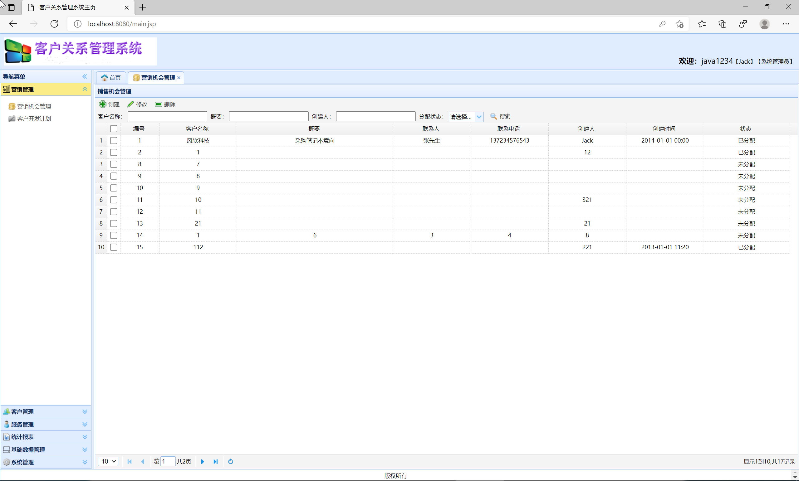
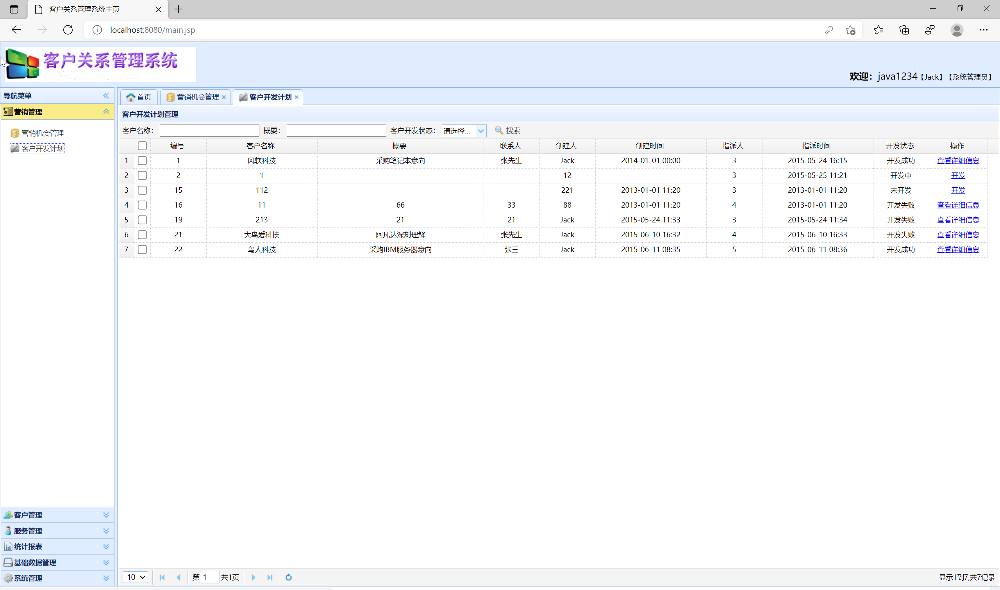
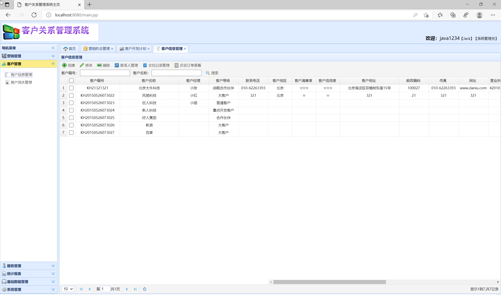
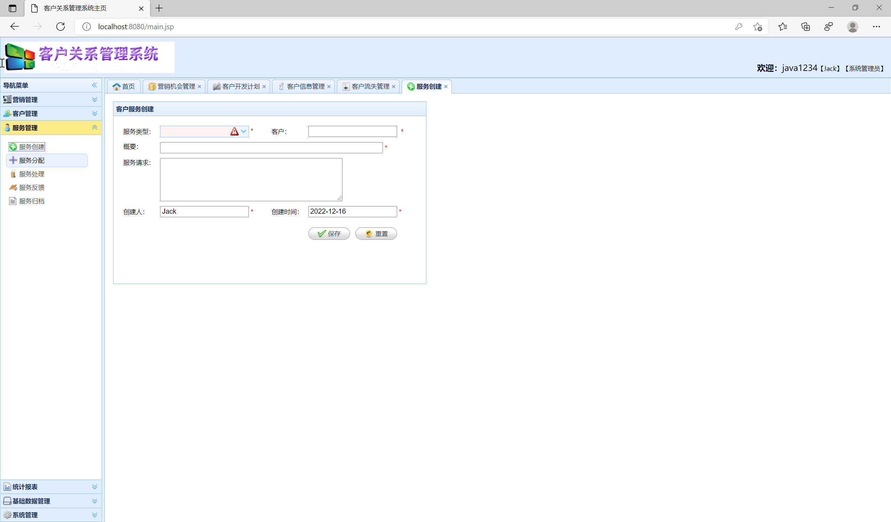
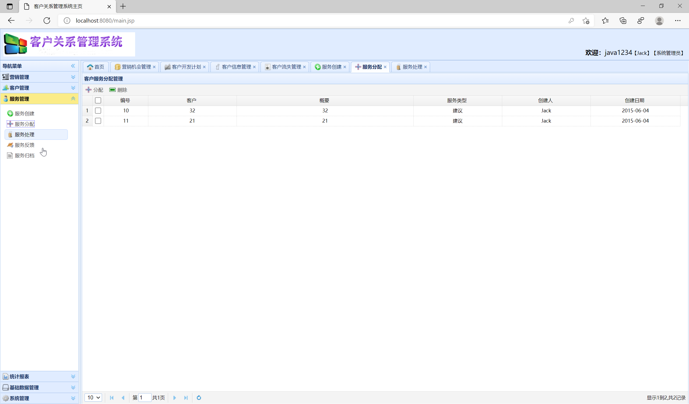
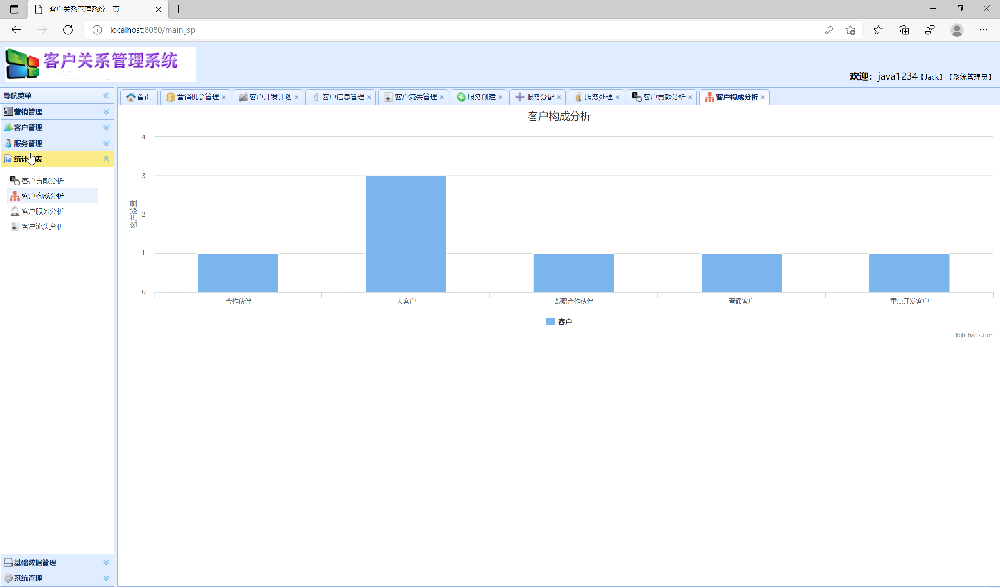
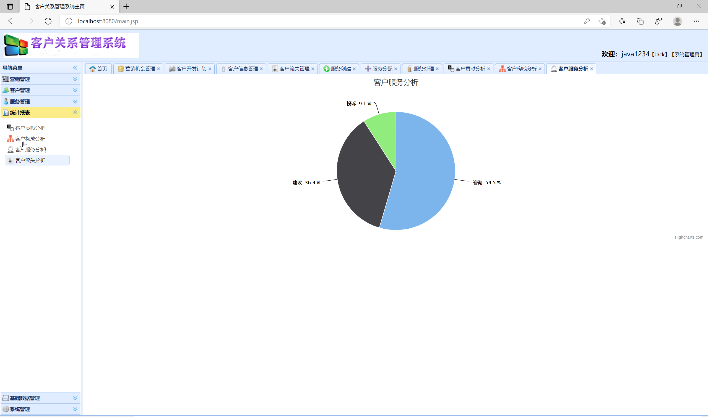
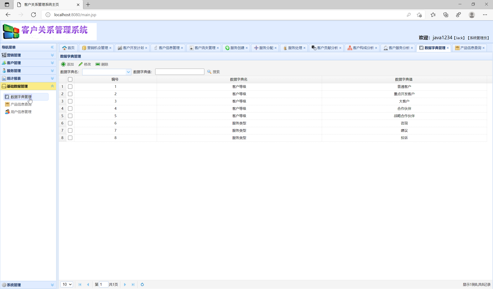
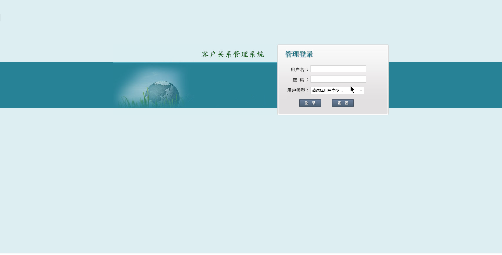

## 基于SSM框架的客户关系管理系统

###  获取sql数据库文件: 从戎源码网 (https://armycodes.com/) QQ: 386869957 QQ群: 377586148
###  所有系统地址: (https://github.com/YuLin-Coder/AllProjectCatalog) 
###  所有项目以及源代码本人均调试运行无问题 可支持远程安装部署调试、定制修改、代码讲解

## 项目介绍
基于SSM框架的客户关系管理系统，系统分为高管、客户经理、销售主管和管理员四个角色，主要功能如下
营销管理：营销机会管理、客户开发计划
客户管理：客户信息管理、客户流失管理
服务管理：服务创建、服务分配、服务处理、服务反馈、服务归档
统计报表：客户贡献分析、客户构成分析、客户服务分析、客户流失分析
基础数据管理：数据字典管理、产品信息查询、用户信息管理

## 项目技术
- 编程语言：Java
- 数据库：MySQL
- 前端技术：JSP、JavaScript、JQuery
- 后端技术：Spring、SpringMVC、MyBatis

## 运行环境
- JDK版本：JDK1.8及以上
- 开发工具：IDEA、Ecplise、Myecplise都可以
- 数据库: MySQL5.7及以上
- Maven：maven3.0及以上

## 运行截图

